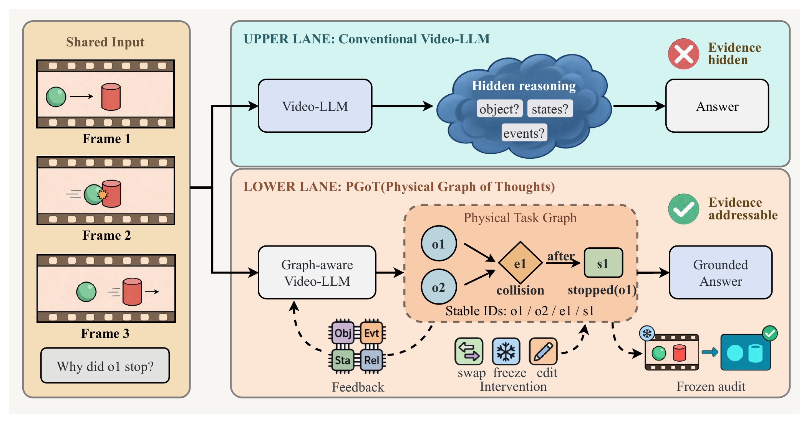
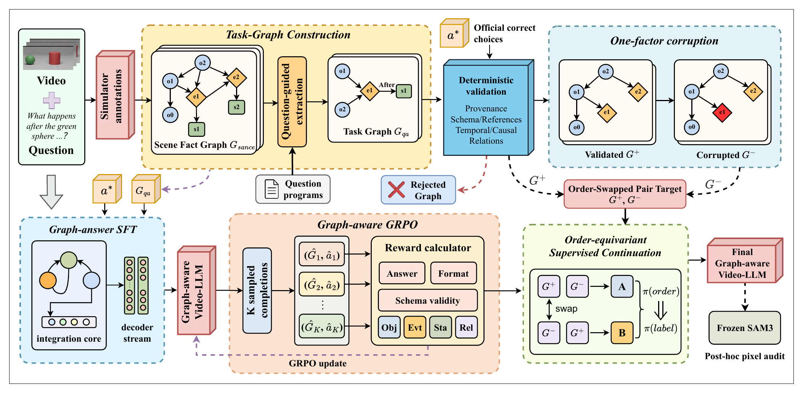
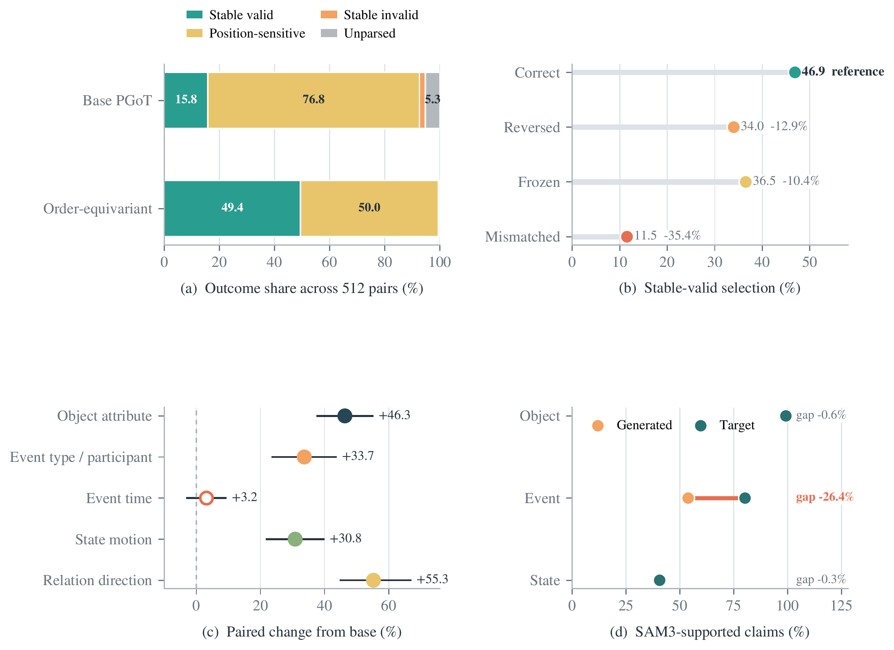
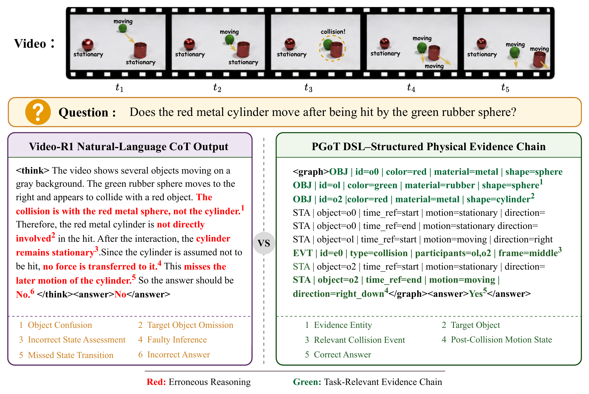

<div align="center">

# PGoT

### Tracking Physical Evidence from Video to Graph, Answer, and Audit

**Chengwen Liu · Shuo Liu · Jisheng Dang<sup>*</sup> · Hong Peng<sup>*</sup> · Qi Tian · Tat-Seng Chua**

<sup>*</sup> Corresponding authors

<p>
  
  
  
</p>

</div>

<p align="center">
  
</p>

## Overview

A correct answer does not necessarily imply the correct physical trace. **PGoT** represents the question-relevant claim as a deterministic Physical Relation Task Graph whose typed object, event, state, and relation identifiers remain stable across learning, intervention, scoring, and visual verification. This continuity makes the model's physical evidence directly addressable and testable.

### Highlights

- **Evidence closure:** supervision, one-factor intervention, component scoring, and visual audit operate on the same physical claim.
- **Order-equivariant learning:** valid and corrupted graphs are presented in both AB and BA orders to suppress candidate-position shortcuts.
- **Typed counterfactuals:** five matched operators isolate object attributes, event semantics and timing, states, and relations.
- **Independent verification:** a frozen SAM3 verifier checks observable graph claims without entering policy optimization.

## Framework

<p align="center">
  
</p>

PGoT constructs a scene fact graph, extracts the question-relevant task graph, and learns graph-answer prediction through SFT and graph-aware GRPO. Deterministically validated one-factor corruptions form order-swapped supervision pairs, while the final model is examined through controlled interventions and a post-hoc pixel audit.

## Key Results

### General video benchmarks

Accuracy (%) under the fixed 16-frame protocol.

| Model | VSI-Bench | VideoMMMU | MMVU | MVBench | TempCompass | Video-MME |
|:--|--:|--:|--:|--:|--:|--:|
| Qwen2.5-VL-7B | 27.7 | **47.4** | 59.2 | 57.4 | 72.2 | 53.1 |
| Video-R1-7B | 34.6 | - | 64.2 | 62.7 | 72.6 | 57.4 |
| **PGoT (7B)** | **36.4** | 46.9 | **64.8** | **63.9** | **73.7** | **57.8** |

### Evidence-closure evaluation

| Evaluation | Base / reference | PGoT |
|:--|--:|--:|
| Locked CLEVRER accuracy | 29.49 | **30.66** |
| Strict answer format | 77.02 | **93.07** |
| Stable-valid graph selection | 15.82 | **49.41** |
| Correct / reversed / frozen / mismatched video | - | **46.88 / 33.98 / 36.52 / 11.52** |

<p align="center">
  
</p>

The 512-pair AB/BA test separates graph identity from candidate position. Video interventions then keep the graph candidates fixed while changing only the footage, and typed edits identify which physical field changes the model's selection.

## Data and Setup

| Item | Configuration |
|:--|:--|
| PGoT-Evidence v2 | 152,572 validated graphs and 152,572 matched one-factor counterfactuals |
| Pair supervision | 4,096 source pairs in both AB/BA orders; 8,192 rows |
| Controlled evaluation | 512 held-out graph pairs; 10,990 component-analysis samples; 256 SAM3-audit samples |
| Benchmarks | CLEVRER, CLEVRER-Humans, VSI-Bench, VideoMMMU, MMVU, MVBench, TempCompass, Video-MME |
| Backbone and input | Qwen2.5-VL-7B-Instruct; 16 uniformly sampled frames |
| Training | Graph-answer SFT, graph-aware GRPO, and 240-update order-equivariant continuation |
| Optimization | 4 GPUs; global batch 8; learning rate 5e-7; bfloat16; DeepSpeed ZeRO-3 |

## Qualitative Example

<p align="center">
  
</p>

The structured trace preserves the queried cylinder, its collision event, and its post-event motion state, while the natural-language baseline confuses the collision target and returns the wrong answer.

## Citation

```bibtex
@misc{liu2026pgot,
  title  = {PGoT: Tracking Physical Evidence from Video to Graph, Answer, and Audit},
  author = {Liu, Chengwen and Liu, Shuo and Dang, Jisheng and Peng, Hong and Tian, Qi and Chua, Tat-Seng},
  year   = {2026}
}
```


