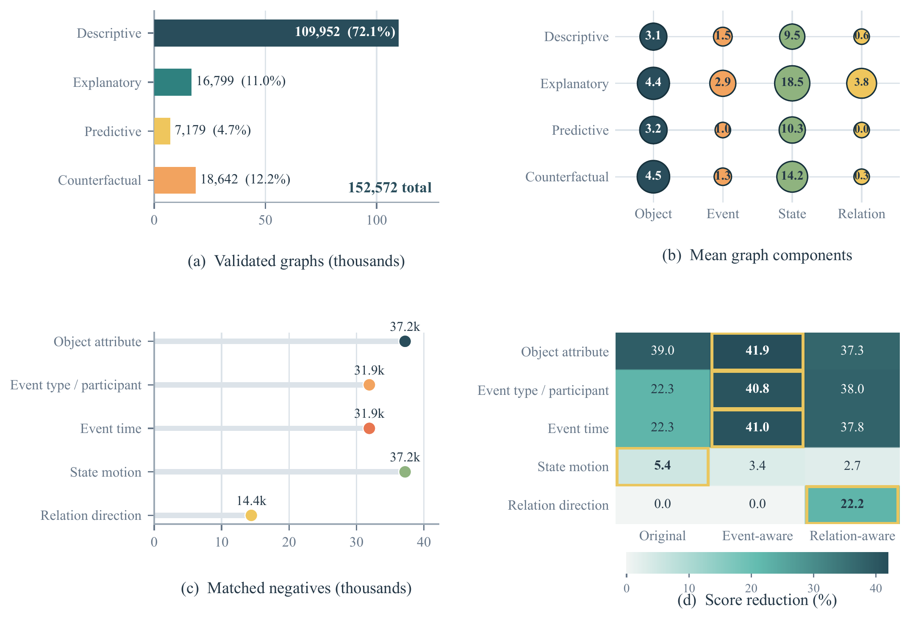
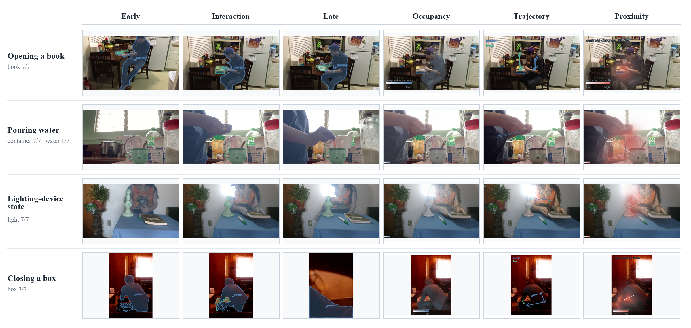

<div align="center">

# PGoT

### Tracking Physical Evidence from Video to Graph, Answer, and Audit

**Chengwen Liu · Shuo Liu · Jisheng Dang<sup>*</sup> · Hong Peng<sup>*</sup> · Qi Tian · Tat-Seng Chua**

<sup>*</sup> Corresponding authors

<p>
  
  
  
  
</p>

**An evidence-closure framework for physical video reasoning.** PGoT keeps the same typed object, event, state, and relation identities from deterministic graph construction to learning, intervention, component scoring, and frozen visual audit.

</div>

<p align="center">
  
</p>

## 🧭 Overview

A correct answer does not guarantee that a Video-LLM tracked the correct object or interpreted the correct event. PGoT makes the intermediate physical claim explicit as a **Physical Relation Task Graph**. Stable typed identifiers turn that graph into an addressable object that can be supervised, counterfactually edited, evaluated under order swaps, and queried by an independent visual verifier.

The resulting evidence chain is evaluated in stages:

1. **Task utility:** general video benchmarks and a locked CLEVRER readout.
2. **Claim identity:** valid/corrupted graph pairs shown in both AB and BA orders.
3. **Video dependence:** correct, reversed, frozen, and mismatched footage with graph text held fixed.
4. **Field sensitivity:** one-factor edits to objects, events, states, and relations.
5. **External support:** component diagnostics and a frozen SAM3 pixel audit.

## ✨ Highlights

- 🧩 **Evidence closure.** The same physical claim is traceable from answer prediction to graph identity, video dependence, component error, and pixel support.
- 🔗 **Deterministic task graphs.** Question programs and simulator annotations produce provenance-tracked graphs with stable object, event, state, and relation identifiers.
- 🔄 **Order-equivariant supervision.** Every valid/corrupted pair is presented in both orders, making candidate position an explicit nuisance variable.
- 🧪 **Matched physical interventions.** Five corruption operators alter exactly one graph factor while preserving the surrounding graph.
- 🔍 **Independent visual audit.** Frozen SAM3 checks observable object, motion, and interaction claims without entering policy optimization.

## 🧩 Framework

<p align="center">
  
</p>

PGoT first constructs a scene fact graph and extracts the question-relevant task graph. Graph-answer SFT and graph-aware GRPO establish structured prediction. Deterministically validated one-factor corruptions then form order-swapped supervision pairs. The final graph-aware Video-LLM is audited after training with controlled interventions and a frozen SAM3 verifier.

## 📊 Main Results

### General video benchmarks

Accuracy (%) under the paper's fixed 16-frame protocol. A dash denotes an unreported result in the cited source.

| Model | VSI-Bench | VideoMMMU | MMVU (MC) | MVBench | TempCompass | Video-MME |
|:--|--:|--:|--:|--:|--:|--:|
| Qwen2.5-VL-7B | 27.7 | **47.4** | 59.2 | 57.4 | 72.2 | 53.1 |
| Video-R1-7B | 34.6 | - | 64.2 | 62.7 | 72.6 | 57.4 |
| **PGoT (7B)** | **36.4** | 46.9 | **64.8** | **63.9** | **73.7** | **57.8** |

### Controlled evidence chain

| Evaluation | Before / reference | PGoT result | Protocol |
|:--|--:|--:|:--|
| Locked CLEVRER average per-question accuracy | 29.49 | **30.66** | Fixed model states, prompts, IDs, and decoding |
| Strict answer formatting | 77.02 | **93.07** | Same locked readout |
| Stable-valid graph selection | 15.82 | **49.41** | 512 held-out pairs, both AB/BA orders |
| Correct-video stable-valid selection | - | **46.88** | Separately locked intervention checkpoint |
| Reversed-video stable-valid selection | 46.88 reference | 33.98 | Only the video tensor is changed |
| Frozen-video stable-valid selection | 46.88 reference | 36.52 | Only the video tensor is changed |
| Mismatched-video stable-valid selection | 46.88 reference | 11.52 | Only the video tensor is changed |

<p align="center">
  
</p>

### One-factor graph interventions

Stable-valid selection (%) on the 512-pair held-out registry:

| Changed factor | Pairs | Base PGoT | Final PGoT |
|:--|--:|--:|--:|
| Object attribute | 123 | 38.21 | **84.55** |
| Event type / participant | 98 | 16.33 | **50.00** |
| Event time | 95 | 3.16 | **6.32** |
| State motion | 120 | 9.17 | **40.00** |
| Relation direction | 76 | 5.26 | **60.53** |

### Structured and pixel-level diagnostics

- On **10,990** descriptive validation samples, the full graph objective reaches **98.35 object F1**, **21.76 event F1**, **86.00 state F1**, and **70.44 graph match**.
- On **256 answer-correct samples**, frozen SAM3 supports **98.6% / 99.2%** of generated / target object claims and **53.8% / 80.3%** of generated / target event claims.
- The two independent audits consistently identify event composition and timing as the most informative target for future optimization.

## 🗂️ Data and Evaluation

### PGoT-Evidence v2

| Resource split | Count |
|:--|--:|
| Descriptive graphs | 109,952 |
| Explanatory graphs | 16,799 |
| Predictive graphs | 7,179 |
| Counterfactual graphs | 18,642 |
| **Schema-validated graphs** | **152,572** |
| Matched one-factor counterfactuals | 152,572 |
| Order-equivariant source pairs | 4,096 |
| AB/BA training rows | 8,192 |
| Held-out intervention pairs | 512 |

<p align="center">
  
</p>

### Benchmarks

| Role | Datasets |
|:--|:--|
| General video capability | VSI-Bench, VideoMMMU, MMVU, MVBench, TempCompass, Video-MME |
| Controlled physical reasoning | CLEVRER, CLEVRER-Humans |
| Cross-domain visual audit | Selected MVBench interactions |

Third-party videos and annotations remain subject to their original licenses. PGoT-Evidence v2 is a program-derived structured augmentation of the source annotations; SAM3 masks are used only as external audit evidence.

## ⚙️ Training and Inference Setup

| Setting | Configuration |
|:--|:--|
| Backbone | Qwen2.5-VL-7B-Instruct |
| Visual input | 16 uniformly sampled frames per video |
| Initialization | Graph-answer SFT for 1 epoch; graph-aware GRPO for up to 1,200 updates |
| Pair continuation | 4,096 source pairs in both AB/BA orders; 240 updates |
| Hardware layout | 4 GPUs; micro-batch 1 per GPU; gradient accumulation 2; global batch 8 |
| Optimizer schedule | Learning rate 5e-7; cosine schedule; 5% warm-up; weight decay 0.01 |
| Numerical stack | bfloat16; DeepSpeed ZeRO-3; gradient checkpointing enabled; vLLM disabled |
| Decoding | Greedy decoding; at most 768 new tokens |
| Statistics | Bootstrap 95% confidence intervals; exact paired McNemar tests |

## 🔎 Qualitative Evidence Trace

<p align="center">
  
</p>

The natural-language baseline confuses the collision target and misses the queried cylinder's later motion. PGoT preserves separate object identifiers, records the collision, and attaches the post-event motion state to the queried object, making the successful evidence chain directly inspectable.

## 🌍 Cross-Domain Visual Audit

<p align="center">
  
</p>

The frozen verifier exposes temporally aligned masks, occupancy, centroid trajectory, and proximity cues on articulated motion, fluid transfer, lighting-state change, and container closure. These are observable support checks rather than causal-sufficiency claims.

## 📌 Release Status

This repository currently contains the project overview, selected figures, experimental summaries, and reproducibility settings. Training and evaluation code are intentionally not included in this initial release.

- [x] Project README and framework figures
- [x] Main benchmark and evidence-closure results
- [x] Dataset and environment summary
- [ ] PGoT-Evidence v2 manifests and construction scripts
- [ ] Training and evaluation code
- [ ] Model checkpoints and complete evaluation registry

## ✍️ Citation

The manuscript is currently under review. Please use the following temporary citation and update it after publication:

```bibtex
@misc{liu2026pgot,
  title  = {PGoT: Tracking Physical Evidence from Video to Graph, Answer, and Audit},
  author = {Liu, Chengwen and Liu, Shuo and Dang, Jisheng and Peng, Hong and Tian, Qi and Chua, Tat-Seng},
  year   = {2026},
  note   = {Manuscript under review}
}
```

## 🙏 Acknowledgements

This work was supported in part by the National Natural Science Foundation of China under Grant U24B20186, the WQ & UCAS Research Academy Intelligent Computing Center (WRA-ICC), and the Supercomputing Center of Lanzhou University.

